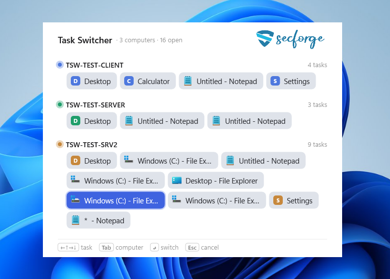

# Multi‑Computer Task Switcher

A keyboard task switcher that aggregates the open windows of your **local PC and every
RDP session you're connected to** into one picker. Press the hotkey, see every task across
all machines grouped by computer, pick one, and it's activated on its owning side — across
the RDP link if needed.

The transport rides **inside the existing RDP connection** (a dynamic virtual channel), so
there's no extra network setup, ports, or firewall changes.



---

## Prerequisites

- Windows 10/11 on the client and on each RDP server.
- You connect to the servers with the built‑in Remote Desktop client (`mstsc.exe`).
- Administrator rights on each machine for the one‑time install (registry + autostart).

---

## Usage

- **Open / close:** hold **Ctrl** and tap **`^`** (the top‑left key). Press again — or
  **Esc** — to close without switching.
- **Navigate:** arrow keys move between tasks (Up/Down by row, Left/Right in order);
  **Tab** jumps to the next computer; holding **Ctrl** and tapping **`^`** cycles tasks.
- **Switch:** **Enter**, a click, or **releasing Ctrl** activates the selected task on its machine.
- The picker opens with the app you were just on preselected, and each machine has a
  **Desktop** entry that minimizes everything and shows that computer's desktop.

The hotkey works whether your keyboard focus is local or inside an RDP session (windowed or
full‑screen), and it works as a plain local switcher even with no RDP session open.

---

## Install — the easy way (double-click)

Put these four files in one folder (e.g. from the release zip):

```
install.cmd   uninstall.cmd   tsw_agent.exe   tsw_plugin.dll
```

Then **double-click `install.cmd`** on the client *and* on each RDP server. It's the **same
script everywhere** — it copies the binaries to `C:\Program Files\TaskSwitcher\`, registers
the Remote Desktop plugin, sets the agent to auto-start, and launches it immediately. One UAC
prompt per machine. To remove, double-click **`uninstall.cmd`**.

After installing on the client, restart any open Remote Desktop windows so the plugin loads.

> The manual steps below do exactly what the scripts automate — use them only if you prefer
> to install by hand or to a custom location.

### Install (manual) — CLIENT (the PC you sit at)

1. **Copy the binaries**, e.g. to `C:\Program Files\TaskSwitcher\`:
   - `tsw_agent.exe`
   - `tsw_plugin.dll`

2. **Register the Remote Desktop plugin** (elevated `cmd`), pointing at the DLL's full path:

   ```bat
   reg add "HKLM\SOFTWARE\Microsoft\Terminal Server Client\Default\AddIns\TaskSwitcher" ^
       /v Name /t REG_SZ /d "C:\Program Files\TaskSwitcher\tsw_plugin.dll" /f
   ```

   Remote Desktop loads the plugin on its next launch — restart any open `mstsc.exe`.

3. **Auto‑start the agent at logon.** `install.cmd` registers a **scheduled task**
   (`TaskSwitcher`, trigger *At logon*, **RunLevel Highest**). Running elevated matters: the
   agent's keyboard hook then outranks elevated windows, so the hotkey works even when Task
   Manager or another admin app is focused. A plain Run key or `shell:startup` shortcut also
   works but runs at medium integrity, so the hotkey is suppressed while an elevated window has
   focus. The agent has **no window** — it runs invisibly, driven entirely by the hotkey.

### Install (manual) — EACH RDP SERVER

1. **Copy `tsw_agent.exe`**, e.g. to `C:\Program Files\TaskSwitcher\`.

2. **Auto‑start it at logon** for the account you sign in with over RDP:

   ```bat
   reg add "HKCU\Software\Microsoft\Windows\CurrentVersion\Run" ^
       /v TaskSwitcher /t REG_SZ /d "\"C:\Program Files\TaskSwitcher\tsw_agent.exe\"" /f
   ```

   It starts at logon and waits until the session is actually being viewed over RDP, then
   opens the channel to your client. No plugin or registry entry is needed on servers.

That's it — servers need **no configuration for multi‑session**. Connect to as many as you
like; their task lists simply add up in the picker. A server without the agent installed is
still fine: it just isn't aggregated (its `mstsc` window stays in the list so you can reach it).

---

## Uninstall

Double-click **`uninstall.cmd`** on each machine — or do it by hand:

On the client:

```bat
reg delete "HKLM\SOFTWARE\Microsoft\Terminal Server Client\Default\AddIns\TaskSwitcher" /f
reg delete "HKCU\Software\Microsoft\Windows\CurrentVersion\Run" /v TaskSwitcher /f
```

On each server:

```bat
reg delete "HKCU\Software\Microsoft\Windows\CurrentVersion\Run" /v TaskSwitcher /f
```

Then end `tsw_agent.exe` (Task Manager) on each machine and delete the install folder.

---

## Components

Two files (statically linked — **no Visual C++ redistributable required**):

| File | Runs where | Role |
|------|-----------|------|
| `tsw_agent.exe` | client **and** every RDP server | One binary. Detects at startup whether it's in an RDP session (`SM_REMOTESESSION`): on your PC it's the **client agent** (shows the picker, aggregates, routes activations); inside an RDP session it's the **session agent** (enumerates that machine's windows, opens the virtual channel). |
| `tsw_plugin.dll` | client only | `mstsc.exe` dynamic‑virtual‑channel plugin. Loaded automatically by Remote Desktop once registered. Bridges each RDP session to the client agent. |

---

## Build (skip if you have prebuilt binaries)

Requires Visual Studio 2022+ with the **C++ CMake tools** component (MSVC, C++17).
CMake is located automatically via `vswhere`.

**From WSL** — building over the WSL↔Windows filesystem boundary is unreliable, so
`wsl-build.bat` copies the checkout to a local Windows dir, builds there, and copies
`dist/` back:

```bash
cmd.exe /c "$(wslpath -w wsl-build.bat)"
```

**From Windows** — run in the checkout:

```bat
wsl-build.bat     REM copy to a local scratch, build, copy dist\ back
build.bat         REM or build in place (fastest when the checkout is on a local disk)
```

Each run **wipes its build scratch and does a full clean Release build**. `dist/` then
holds the complete, minimal install bundle:

```
tsw_agent.exe   tsw_plugin.dll   install.cmd   uninstall.cmd   README.md
```

The picker's logo is embedded via the committed header `src/client_agent/logo_png.h`
(so the build needs no SVG toolchain). To change it, edit `assets/logo.svg` /
`assets/logo-white.svg`, run `tools/update-logo.sh` (needs `rsvg-convert`), and commit
the regenerated header.

---

## How it works

- **One binary, two roles.** `tsw_agent.exe` checks `SM_REMOTESESSION` at startup: on your PC
  it's the **client agent** (the hub); inside an RDP session it's the **session agent**.
- **Transport rides the RDP link.** Inside each `mstsc.exe`, `tsw_plugin.dll` opens a dynamic
  virtual channel to the matching session agent and bridges it to the client agent over a local
  named pipe. No sockets, ports, or firewall changes.
- **The client is the sole hub.** Servers only send their window list and obey activation
  requests; the client aggregates every endpoint's windows and routes each pick to its owning
  side — foregrounding the correct `mstsc` window locally, then activating the target remotely.
- **Pull, not push.** Nothing is enumerated until you open the picker: the client fans out an
  `EnumRequest`, each server replies with a snapshot, and the picker fills in incrementally so a
  slow or absent server never blocks it.
- **Fully event-driven.** When idle, nothing runs — no polling, no heartbeat. Every read blocks
  until data arrives; the session agent detects an RDP reconnect (its channel goes stale) via
  Windows session-change notifications and reopens the channel.
- **UI.** The picker is a Direct2D acrylic panel, grouped by computer, with per-app icons and a
  per-machine most-recently-used order.

## Notes

- The two binaries are self‑contained (static CRT); copy‑deploy works on a fresh Windows.
- The agent runs **in the interactive session**, not as a service — it needs a desktop for
  the picker and the keyboard hook.
- `TSW_CONNECT`, `TSW_DUMP_FILE`, and `TSW_ACTIVATE_FILE` environment variables are
  development/test hooks only and are not needed for normal use.

---

## License

Source code: [MIT](LICENSE). Provided **as is — use at your own risk**: no warranty of any
kind, and the authors accept no liability for any damages arising from its use (installation
runs elevated and it hooks the keyboard across your RDP sessions).

**The branding is NOT MIT.** The name **"secforge"** and the **secforge logo** are trademarks
of secforge GmbH and are excluded from the license. You **may** redistribute secforge's
**original, unmodified release binaries** with the branding intact, as long as the copyright
notice and license are kept with them. But if you **rebuild, modify, or fork**, you **must
replace the logo** — `assets/logo.svg`, `assets/logo-white.svg`, and the embedded
`src/client_agent/logo_png.h` (regenerate with `tools/update-logo.sh`) — and remove the
"secforge" name from the UI and docs. The logo is compiled into `tsw_agent.exe`, so a binary
you build yourself carries the mark until you replace it. See [LICENSE](LICENSE).
